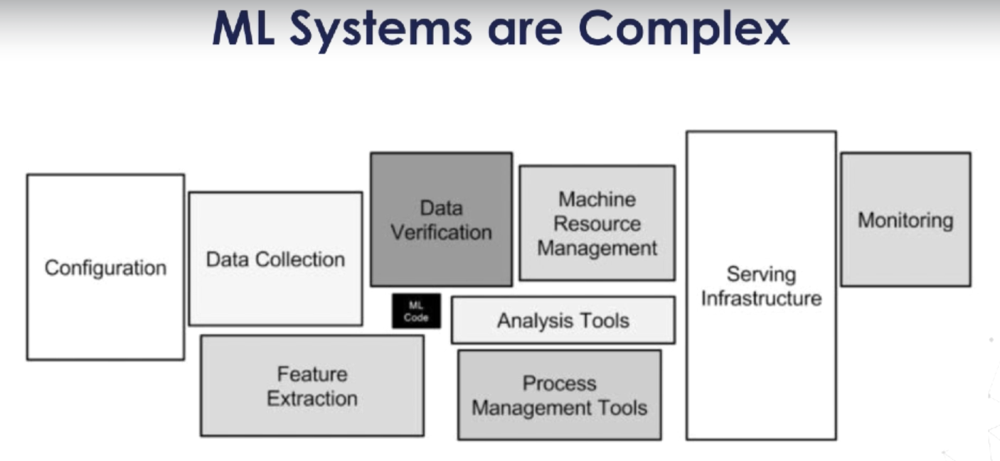

# Arquitetura de Sistemas de ML

---

## 1. Desafios de Sistemas de ML

  

Nota que o Código de ML é o menor dos problemas no meio de tantos. 

- Testing: `Pytest`

## 2. Servindo Modelos de ML - Formatos

- Pickle
- MLflow

